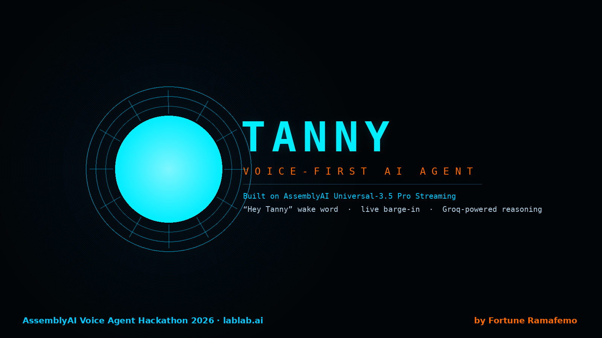

# TANNY — Voice-First AI Agent

**Built for the AssemblyAI Voice Agent Hackathon (lablab.ai, Sep 2026)**

A JARVIS-style HUD assistant you talk to, not type at. Say **"Hey Tanny"**, ask it anything, and interrupt it whenever you want — it stops talking the instant you start.



## What it does

- **Real wake word.** No push-to-talk button. TANNY listens continuously; say "Hey Tanny" (or "Okay Tanny", or just "Tanny") and it acts on whatever follows.
- **Real-time streaming transcription.** Powered by AssemblyAI's Universal-3.5 Pro streaming model — partial transcripts appear live as you speak, with a fully formatted final transcript on turn end.
- **True barge-in.** AssemblyAI's `SpeechStarted` event fires the instant you start talking, which cuts TANNY's speech synthesis off mid-sentence. No talking over each other.
- **JARVIS-grade reasoning.** Groq's Llama 3.3 70B, running behind a local daemon, in a witty/precise in-character persona ("Sir", British composure, Stark Industries flavor).
- **A full Iron Man HUD**, built from scratch: arc reactor boot sequence, live simulations (physics/particle/neural/fractal), a chat interface, and system telemetry panels.

## Architecture

```
Mic (browser)  →  AssemblyAI Universal-3.5 Pro streaming WS  →  Groq Llama 3.3 70B  →  Browser TTS + HUD
                         ↑
              temp token minted by aai_token_server.py
              (the real AssemblyAI API key never reaches the browser)
```

## Why AssemblyAI

TANNY's entire voice-input pipeline runs on AssemblyAI:

- `wss://streaming.assemblyai.com/v3/ws` with `speech_model=universal-3-5-pro` for real-time transcription
- Temporary tokens (`GET /v3/token`) minted server-side, so the permanent API key is never exposed to the browser
- `Turn` events (partial + `end_of_turn`) drive both the live transcript display and the wake-word matching
- `SpeechStarted` events drive barge-in / interruption handling

## Running it locally

You'll need Python 3 and an [AssemblyAI API key](https://www.assemblyai.com/dashboard) (free tier works).

```bash
# 1. Set your AssemblyAI key
export ASSEMBLYAI_API_KEY="your-key-here"      # macOS/Linux
setx ASSEMBLYAI_API_KEY "your-key-here"        # Windows (reopen terminal after)

# 2. Start the AssemblyAI token server (no dependencies — stdlib only)
python aai_token_server.py

# 3. Start the Groq daemon (your existing server.py)
python server.py

# 4. Open tanny.html in Chrome and click the mic
```

## Roadmap

- Swap browser TTS for a natural streaming voice (ElevenLabs)
- Task automation — let TANNY actually execute commands, not just describe them
- Background/always-on daemon mode
- Migrate to AssemblyAI's full Voice Agent API for a single-pipeline STT + turn-taking + TTS loop

## Author

Fortune Ramafemo — Final-year BSc Computer Science & Physical Science, University of the Western Cape
